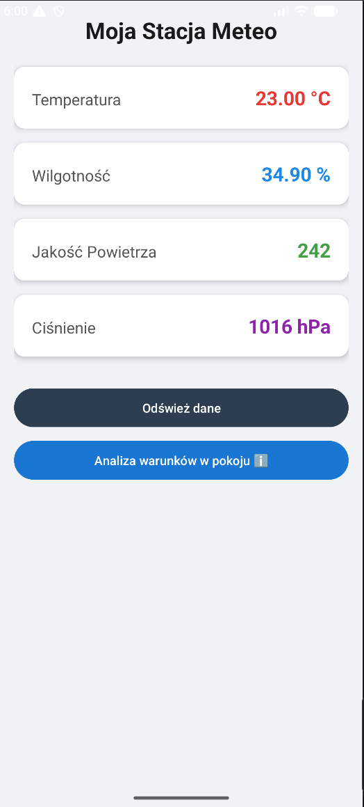
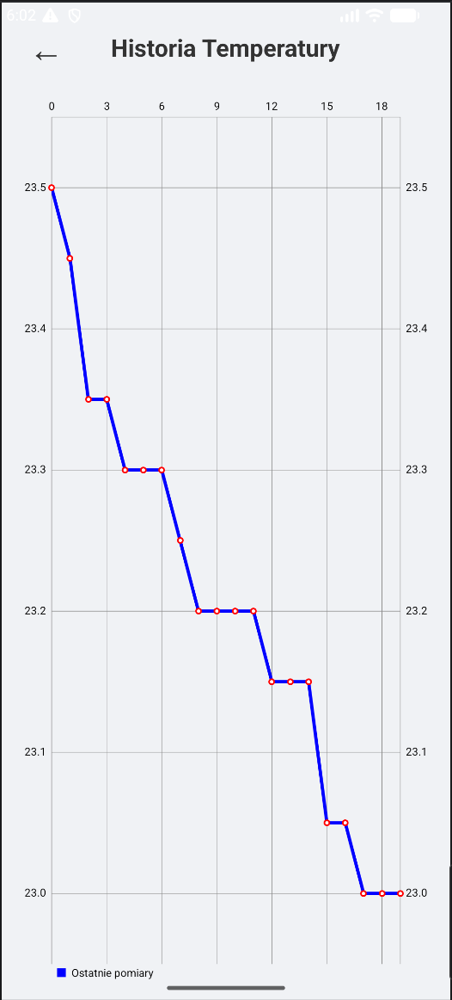
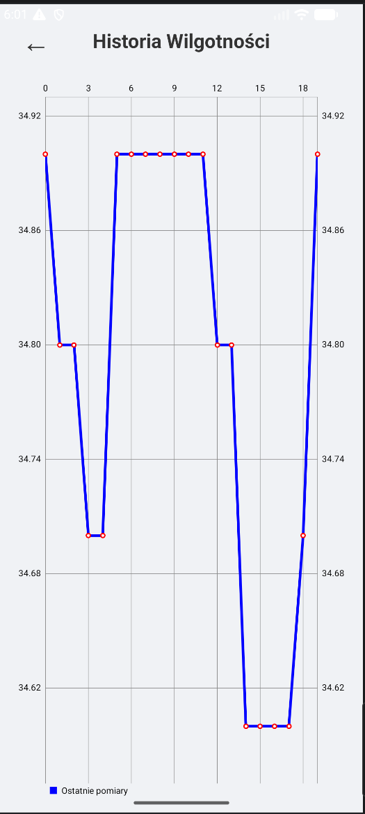
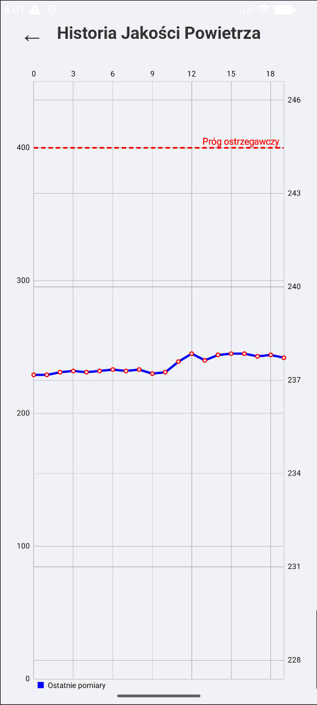
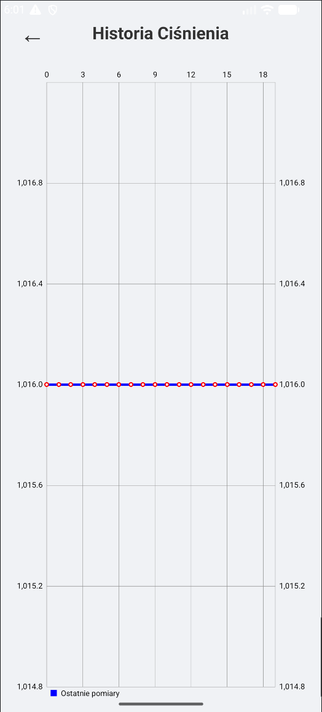
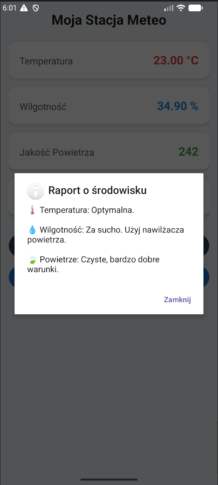

# 📱 IoT Weather Station - Android Mobile Application

This repository contains the mobile application for the **IoT Weather Station** system. The app connects to the **ThingSpeak API** to provide real-time monitoring, historical data visualization, and smart environmental alerts based on data collected by custom Arduino hardware.

## 🔌 Hardware Companion
This mobile app is the front-end interface for a physical IoT weather station. You can find the C++ code, sensor configurations, and hardware setup instructions in the companion repository:
👉 **[Arduino Simple Weather Station Repository](https://github.com/WhiteRed14/Arduino_simple_weather_station)**

## 🌟 Key Features
* **Real-time Dashboard:** Instant access to temperature, humidity, atmospheric pressure, and air quality.
* **Interactive Charts:** Detailed historical data analysis using `MPAndroidChart`.
* **Smart Alerts:** Push notifications for extreme temperatures and dangerous air quality levels.
* **Environmental Insights:** Intelligent tips on whether to ventilate the room or use a humidifier.
* **Modern UI:** Clean, card-based interface with dynamic data updates.

## 📸 Screenshots

| Main Dashboard | Temperature Analytics | Humidity Trends |
|:---:|:---:|:---:|
|  |  |  |

| Air Quality & Smog | Pressure History | Weather Report |
|:---:|:---:|:---:|
|  |  |  |

## 🛠️ Tech Stack
* **Language:** Java
* **Platform:** Android Studio
* **Networking:** Volley Library (REST API calls)
* **Data Visualization:** MPAndroidChart
* **Backend:** ThingSpeak Cloud

## 🚦 Smart Thresholds & Alarms
The application monitors the following safety ranges:
* **Temperature:** Alerts if < 19°C or > 25°C.
* **Humidity:** Alerts if < 40% or > 60%.
* **Air Quality:** Real-time smog detection based on MQ-135 sensor readings.

## ⚙️ Setup & Installation
1.  Clone this repository.
2.  Open the `mobile_app` folder in **Android Studio**.
3.  Configure your **ThingSpeak Channel ID** and **Read API Key** in `MainActivity.java`.
4.  Build and run the APK on your Android device (Minimum SDK: 24).

---
*Developed as part of an IoT monitoring system project.*
